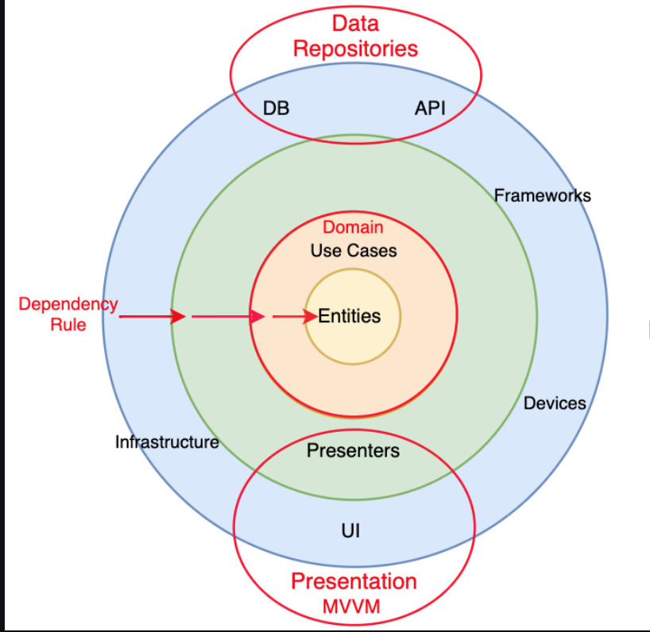

# Air Holland
The purpose of this document is to explain the architecture of application.

This application shows events from network first time.
After this, the events are available to view in offline mode and can be refreshed from network with pull to refresh feature.

Below are running app screenshots:

  

## Table of Contents
1. [Architecture]
2. [Implementation]
3. [Testing]
4. [Project Setup]

## 1. Architecture
The project is divided into different folder which act as logical units. Each unit has its own responsibility and behaviour. All components communication is done using abstraction. 
This app divided into below folder structure:
This diagram will illustrate high level implementation of architecture

### Presentation:
Responsible to handle all user events on view.
It consist below things:

[***ViewModel***]:
It is responsible to update the result of business logic to viewController. this update is handled using view to viewModel binding.

[***ViewController***]: It links the user controls to update them when needed. View will inform view model about user action.

### Domain:

Handler of all business logic and models.
It consist below things:

[***Models***]: Models are Entities domain model representation.

[***UseCases***]: It is responsible to handle use case and business logic. Protocols and their implementations to represent business logics

[***ProviderProtocols***]: These are Protocol which can be confirmed in data layer.

### Data:
Responsible to retrieve all the data required by the application. Source of this data can be from remote or from local.
It consist below things:

[***Entities***]: It defines structs for responses representation.

[***Services***]: Service layer is an abstraction layer on top of [Moya](https://github.com/Moya/Moya)

[***Repositories***]: Repository is for handling local data storage, right now this project uses [Core Data](https://developer.apple.com/documentation/coredata)

[***Providers***]: It handle the services and retrieve the data either from services (the network API call) or from local data storage response which are represented in Entities.

## 2. Implementation
To develop this, MVVM-CLEAN architecture is used.
[Swift Package Manager](https://swift.org/package-manager/) is used as a dependency manager.
The code is divided into into logical units and each logical units have different-different responsibilities. 

**DIContainer**
Responsible to inject objects of dependable classes.

**FlowConfigurator**
Responsible to route from one ViewController to another ViewController 

## 3. Testing
* Under Presentation module, there are unit test cases for viewModels.
* Under Domain module, there are unit test cases for Models and UseCases.
* PENDING - Data module, we will have unit test cases for Entities Providers and repositories.

## 4. Project Setup
To run this project on a local machine follow below steps:

* Open AirHolland.xcodeproj file in Xcode 13.x version and wait till required swift packages loading is done. In case of build error, please select option Xcode -> File -> Packages -> Update to Latest Package Versions

## 4. Pending Things (// TODOs)
* Add test cases for Data Layer
* Inject repository from DIContainer
* Improve overall code coverage
